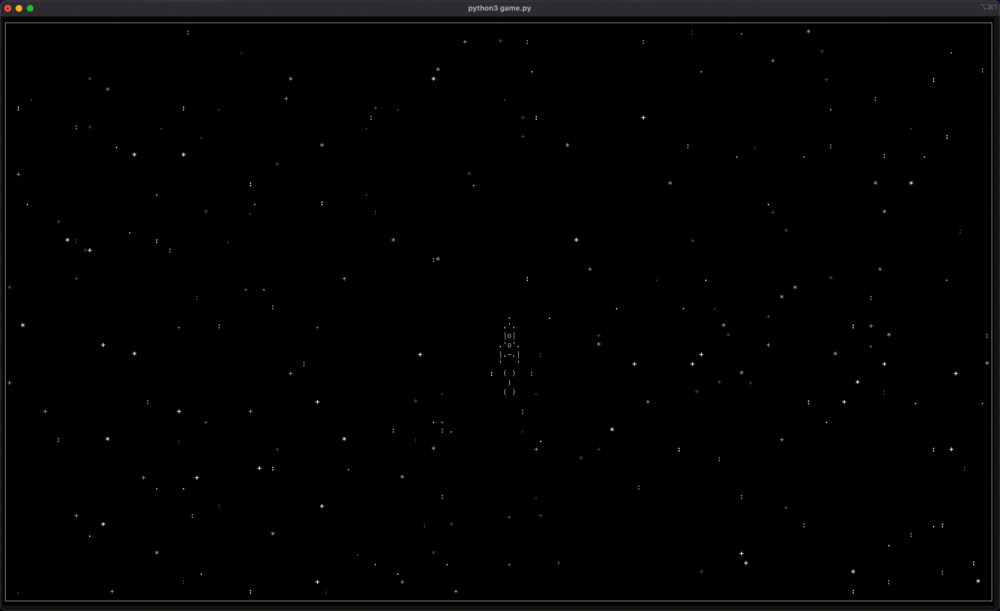

# async-console-game

## Description

Simple console game to learn more about coroutines in Python. You will be able to control the spaceship in your terminal with arrow keys on your keybord.


## Getting started

Just run the script and the game will start:

```
python3 game.py
```
